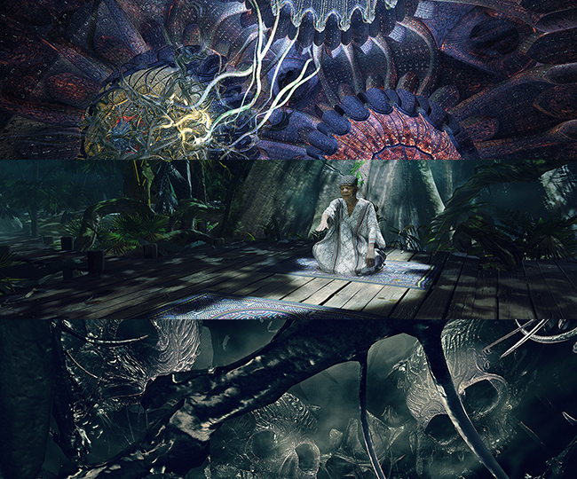

## VR/AR/Virtual Production Developer and Technical Director

[Email](mailto:jean.dellac@tuta.io) - [Resume](/tutorial.md) - [Linkedin](/tutorial.md)

### What do I do?

Hi, I'm Jean and I design and develop Virtual Reality and Augmented Reality experiences.
The two latests pieces I worked on at Small Studio in Paris are 7 Lives and Ayahuasca and Kosmik Journey, two prfound award winning narrative VR experiences.

My background is in virtual production, which I studied and put in practice on the field, developing custom software solution for on-set previz and setting it up on set.

